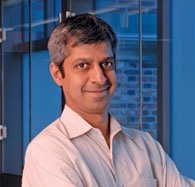
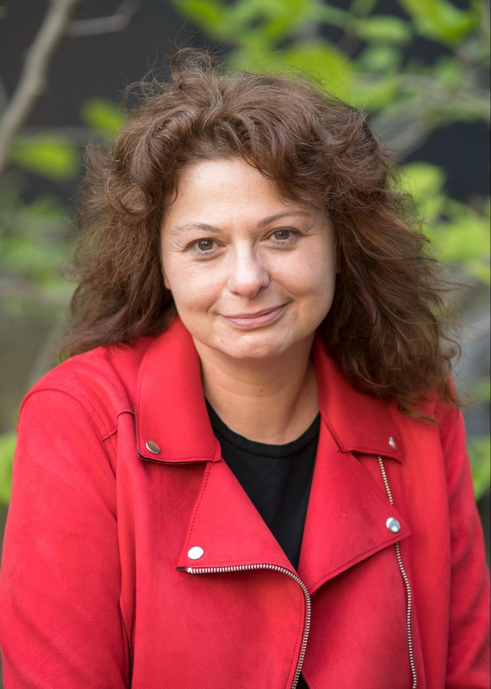

<html><head><meta content="text/html; charset=UTF-8" http-equiv="content-type"></head><body class="c17 doc-content"><h1 class="c12" id="h.e42rihvglwkb">Keynote Speakers</h1>

<table class="c15"><tr class="c10"><td class="c6" colspan="2" rowspan="1">
Thursday, October 19th, 14:00 CET
</td></tr><tr class="c13"><td class="c19" colspan="1" rowspan="1">

</td><td class="c20" colspan="1" rowspan="1">
Model Checking for Safe Autonomy

Rajeev Alur, University of Pennsylvania

Abstract

We focus on the problem of formally verifying correctness requirements of a closed-loop control system where the controller is trained using machine learning. As an illustrative realistic case study, we consider an autonomous car that navigates a structured environment using a neural-network-based controller. In this scenario, safety corresponds to avoiding collisions, and we first discuss how to formalize this as a verification problem. Then we describe a specific solution strategy, advocated by the verification tool Verisig, which relies on tools for

computing reachable states of hybrid dynamical systems. We conclude by discussing challenges and opportunities for applying formal verification to establish safety of autonomous systems with learning-enabled components.

Bio

Rajeev Alur is Zisman Family Professor of Computer and Information Science and the Founding Director of ASSET (Center for AI-Enabled Systems: Safe Explainable, and Trustworthy) at University of Pennsylvania. He obtained his bachelor&#39;s degree in computer science from IIT Kanpur in 1987 and PhD in computer science from Stanford University in 1991. Before joining Penn in 1997, he was with Computing Science Research Center at Bell Labs. His research is focused on formal methods for system design, and spans artificial intelligence, cyber-physical systems, distributed systems, logic in computer science, machine learning, and programming languages. He is a Fellow of the AAAS, a Fellow of the ACM, a Fellow of the IEEE, an Alfred P. Sloan Faculty Fellow, and a Simons Investigator. He was awarded the inaugural CAV (Computer-Aided Verification) award in 2008, ACM/IEEE Logic in Computer Science (LICS) Test-of-Time award in 2010, the inaugural Alonzo Church award by ACM SIGLOG / EATCS / EACSL / Kurt Goedel Society in 2016, Distinguished Alumnus Award by IIT Kanpur in 2017 for his work on timed automata. Prof. Alur has served as the chair of ACM SIGBED (Special Interest Group on Embedded Systems), the general chair of LICS, and the lead PI of the NSF Expeditions in Computing center ExCAPE (Expeditions in Computer Augmented Program Engineering). He is the author of the textbook Principles of Cyber-Physical Systems&nbsp;(MIT Press, 2015).
</td></tr></table>

<table class="c15"><tr class="c10"><td class="c6" colspan="2" rowspan="1">
Friday, October 20th, 14:00 CET
</td></tr><tr class="c13"><td class="c21" colspan="1" rowspan="1">

</td><td class="c3" colspan="1" rowspan="1">
Assurance for Software Product Lines Through Lifting and Reuse

Marsha Chechik, University of Toronto

Abstract

From financial services platforms to social networks to vehicle control, complex software has come to mediate many activities of daily life. Software failures can have significant consequences to individuals, organizations and societies. As such, stakeholders require evidence-based assurance that software satisfies key requirements &ndash; for instance, that it is safe, secure, or protects privacy. Evidence is often generated using testing or verification techniques, making creation and maintenance of assurance an expensive process. &nbsp;Furthermore, many industries -- from automotive to aerospace to consumer electronics -- develop and maintain complex families of software systems in the form of product lines, which can yield billions of distinct products. It is infeasible to create evidence and assure each possible product individually; thus, there is a clear need for new approaches for assuring software product lines.

In this talk, I will discuss approaches for reuse of analyses and evidence through the formal process of lifting. I will provide an overview of recent results in this space and identify future challenges. 

Bio

Marsha Chechik is Professor in the Department of Computer Science (DCS) at the University of Toronto. She has served as Chair of DCS in 2019-22 and as Acting Dean of the Faculty of Information in 2022. &nbsp; She received her Ph.D. from the University of Maryland. Prof. Chechik&rsquo;s research interests are in the application of formal methods to improve the quality of software. She has authored over 200 papers in formal methods, software specification and verification, computer safety and security and requirements engineering. Marsha Chechik is Program Co-Chair of the 2024 International Conference on Model-Driven Engineering (MODELS&#39;24). &nbsp;She has been Program Committee Co-Chair of the 2023 International Conference on Formal Methods (FM&rsquo;23), 2021 International Conference on Foundations of Software Engineering (ESEC/FSE&rsquo;21), 2018 International Conference in Software Engineering (ICSE&rsquo;18), 2016 International Conference on Tools and Algorithms for the Construction and Analysis of Systems (TACAS&rsquo;16), the 2016 Working Conference on Verified Software: Theories, Tools, and Experiments (VSTTE16), the 2014 International Conference on Automated Software Engineering (ASE&rsquo;14), the 2008 International Conference on Concurrency Theory (CONCUR&rsquo;08), the 2008 International Conference on Computer Science and Software Engineering (CASCON&rsquo;08), and the 2009 International Conference on Formal Aspects of Software Engineering (FASE&rsquo;09). She is a Distinguished Member of ACM, a Vice Chair of ACM SIGSOFT, and holds a Bell University Chair in Software Engineering.
</td></tr></table>

</body></html>